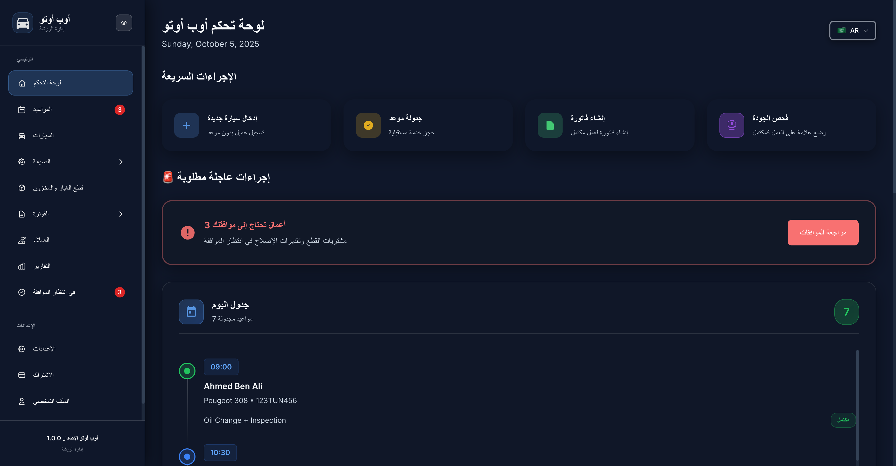
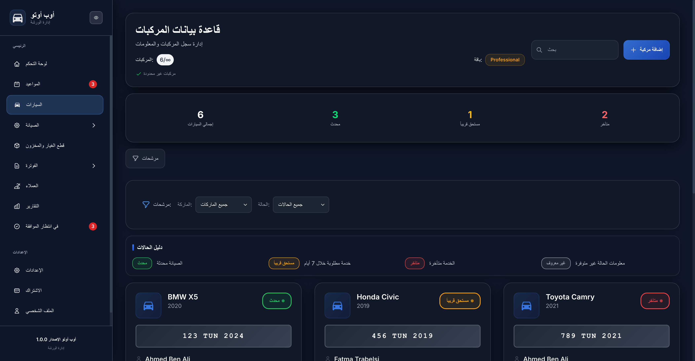

# 🚗 OpAuto - Modern Garage Management System

<div align="center">


**Professional garage management solution with modern glassmorphism design**

[](https://angular.io/)
[](https://www.typescriptlang.org/)
[](https://tailwindcss.com/)
[](https://web.dev/progressive-web-apps/)
[](LICENSE)

[🚀 Demo](#demo) • [✨ Features](#features) • [📱 Screenshots](#screenshots) • [🛠️ Installation](#installation) • [📖 Documentation](#documentation)

</div>

---

## 🌟 Overview

**OpAuto** is a cutting-edge garage management system designed for modern automotive service providers. Built with Angular 15+ and featuring a stunning glassmorphism dark-mode interface, it streamlines operations from appointment scheduling to invoice generation.

### 🎯 Key Highlights

- **🌙 Permanent Dark Mode** - Beautiful glassmorphism design optimized for professional use
- **🌍 Multilingual Support** - English, French, and Arabic with RTL layout support
- **📱 Mobile-First PWA** - Native app experience on all devices
- **⚡ Real-Time Dashboard** - Live metrics and job progress tracking
- **🔧 Complete Workflow** - From car registration to invoice generation
- **🎨 Modern UI/UX** - Apple-style interface with smooth animations

---

## 📱 Screenshots

### 🏠 Dashboard Overview
*Real-time garage metrics, today's schedule, and quick actions*


<details>
<summary>🌍 Multilingual Interface</summary>


*Arabic language with RTL layout support*

</details>

### 🚗 Vehicle Management
*Complete car registry with service history and status tracking*



### 🔧 Maintenance & Service Jobs
*Active job tracking with progress monitoring and status updates*


### 📦 Parts & Inventory
*Smart inventory management with low stock alerts and usage analytics*


---

## ✨ Features

### 🏠 **Intelligent Dashboard**
- **Real-time metrics** - Live garage performance indicators
- **Today's schedule** - Complete appointment timeline
- **Active job monitoring** - Progress tracking with visual indicators
- **Quick actions** - One-click access to common tasks
- **Urgent alerts** - Approval requests and critical notifications

### 🚗 **Vehicle Management**
- **Complete car profiles** - Registration with customer linking
- **Service history** - Comprehensive maintenance records
- **Status tracking** - Up-to-date, due soon, overdue indicators
- **Smart filtering** - By make, model, status, and customer
- **Maintenance scheduling** - Direct appointment booking

### 🔧 **Maintenance Operations**
- **Job lifecycle management** - From creation to completion
- **Multi-status workflow** - Waiting, in-progress, approval, completed
- **Progress tracking** - Real-time job completion percentages
- **Photo attachments** - Visual documentation support
- **Priority levels** - Low, medium, high, urgent classification

### 📅 **Appointment System**
- **Smart calendar** - Daily, weekly, monthly views
- **Touch-friendly scheduling** - Mobile-optimized interface
- **Mechanic assignment** - Resource allocation tracking
- **Status management** - Scheduled, in-progress, completed, delayed
- **Swipe gestures** - Mobile navigation support

### 📦 **Inventory Management**
- **Smart stock tracking** - Real-time inventory levels
- **Low stock alerts** - Automated reorder notifications
- **Category organization** - Engine, transmission, brakes, etc.
- **Usage analytics** - Most used parts tracking
- **Supplier management** - Vendor information and performance

### 🧾 **Financial Management**
- **Professional invoicing** - Automated bill generation
- **Multi-payment support** - Cash, card, bank transfer, check
- **Payment tracking** - Status monitoring and overdue alerts
- **Revenue analytics** - Daily, weekly, monthly reports
- **Cost breakdown** - Parts and labor separation

### 👥 **Customer Relations**
- **Complete profiles** - Personal and vehicle information
- **Service history** - Comprehensive customer records
- **Loyalty tiers** - Bronze, silver, gold, platinum
- **Communication logs** - Interaction history tracking
- **Status management** - Active, VIP, inactive, blocked

### 👨‍🔧 **Employee Management**
- **Staff profiles** - Skills, certifications, experience
- **Performance tracking** - Productivity and quality metrics
- **Availability management** - Real-time status updates
- **Workload balancing** - Fair task distribution
- **Training records** - Certification and skill development

### ✅ **Approval System**
- **Multi-level workflow** - Parts purchasing and service approvals
- **Priority classification** - Urgent to low priority requests
- **Bulk operations** - Mass approval/rejection capabilities
- **Request tracking** - Complete approval history
- **Cost validation** - Estimated vs actual cost monitoring

### 📊 **Advanced Analytics**
- **Financial reports** - Revenue, profit, cost analysis
- **Operational metrics** - Efficiency and performance KPIs
- **Customer analytics** - Retention and satisfaction metrics
- **Inventory reports** - Stock optimization insights
- **Interactive charts** - Visual data representation

### ⚙️ **System Configuration**
- **Garage setup** - Business information and branding
- **Operational settings** - Hours, slots, capacity planning
- **User management** - Access control and permissions
- **Integration options** - Third-party service connections
- **Backup and sync** - Data protection and recovery

---

## 🛠️ Technology Stack

### Frontend Technologies
- **[Angular 15+](https://angular.io/)** - Modern web framework with standalone components
- **[TypeScript 5.0+](https://www.typescriptlang.org/)** - Type-safe development
- **[TailwindCSS 3.0+](https://tailwindcss.com/)** - Utility-first CSS framework
- **[RxJS](https://rxjs.dev/)** - Reactive programming with observables
- **[Chart.js](https://www.chartjs.org/)** - Interactive data visualizations

### Backend Technologies
- **[Spring Boot](https://spring.io/projects/spring-boot)** - Java/Kotlin backend framework
- **[PostgreSQL](https://www.postgresql.org/)** - Robust relational database
- **[JWT Authentication](https://jwt.io/)** - Secure token-based authentication
- **[Docker](https://www.docker.com/)** - Containerization and deployment

### Development Tools
- **[Angular CLI](https://cli.angular.io/)** - Development and build tooling
- **[ESLint](https://eslint.org/)** - Code quality and consistency
- **[Prettier](https://prettier.io/)** - Code formatting
- **[Karma & Jasmine](https://karma-runner.github.io/)** - Unit testing framework

### Key Features
- **Progressive Web App (PWA)** - Native app experience
- **Server-Side Rendering (SSR)** - SEO optimization
- **Lazy Loading** - Optimized performance
- **Tree Shaking** - Minimal bundle sizes
- **Hot Module Replacement** - Fast development cycles

---

## 🚀 Installation

### Prerequisites
- **Node.js** (v18 or higher)
- **npm** (v9 or higher) or **yarn**
- **Angular CLI** (v15 or higher)
- **Java 21 LTS** (for backend)
- **Docker & Docker Compose** (for containerized setup)

### Quick Start (Frontend Only)

```bash
# Clone the repository
git clone https://github.com/your-username/OpAuto-front.git
cd OpAuto-front

# Install dependencies
npm install

# Start development server
npm start

# Open your browser
open http://localhost:4200
```

### Full Stack Setup

```bash
# Clone the main repository
git clone https://github.com/alabenkhlifa/opauto.git
cd opauto

# Start with Docker Compose
docker-compose up -d

# Or setup manually:

# Backend setup
cd backend
./gradlew bootRun

# Frontend setup (in new terminal)
cd frontend
npm install
npm start
```

### Development Commands

```bash
# Development server with hot reload
npm start

# Build for production
npm run build

# Run unit tests
npm test

# Run e2e tests
npm run e2e

# Lint and format code
npm run lint
npm run format

# Build and serve production build
npm run build:prod
npm run serve:prod
```

### Production Build

```bash
# Build optimized production bundle
npm run build:prod

# The build artifacts will be stored in the `dist/` directory
```

---

## 📖 Documentation

### Project Structure
```
src/
├── app/
│   ├── core/                 # Singleton services, guards, models
│   ├── shared/              # Reusable components, pipes, directives
│   ├── features/            # Feature modules
│   │   ├── dashboard/       # Dashboard and analytics
│   │   ├── cars/            # Vehicle management
│   │   ├── maintenance/     # Service job management
│   │   ├── appointments/    # Scheduling system
│   │   ├── inventory/       # Parts and stock management
│   │   ├── invoicing/       # Financial management
│   │   ├── customers/       # Customer relations
│   │   ├── employees/       # Staff management
│   │   ├── approvals/       # Approval workflows
│   │   ├── reports/         # Analytics and reporting
│   │   └── garage-settings/ # System configuration
│   └── layouts/             # Application layouts
├── assets/                  # Static assets and translations
├── styles/                  # Global styles and themes
└── environments/            # Environment configurations
```

### Key Configuration Files
- **`angular.json`** - Angular workspace configuration
- **`tailwind.config.js`** - TailwindCSS customization
- **`tsconfig.json`** - TypeScript compiler options
- **`package.json`** - Dependencies and scripts

### Environment Configuration
```typescript
// src/environments/environment.ts
export const environment = {
  production: false,
  apiUrl: 'http://localhost:3000/api',
  appVersion: '1.0.0',
  supportedLanguages: ['en', 'fr', 'ar'],
  defaultLanguage: 'en'
};
```

---

## 🌍 Internationalization

### Supported Languages
- **🇺🇸 English** - Primary language
- **🇫🇷 French** - Secondary language  
- **🇸🇦 Arabic** - RTL layout support

### Adding New Languages
1. Create translation file in `src/assets/i18n/[lang].json`
2. Add language to `environment.ts` configuration
3. Update language toggle component
4. Test RTL layout if applicable

---

## 🎨 Design System

### Color Palette
- **Primary**: Blue gradient (#3B82F6 → #1D4ED8)
- **Success**: Green gradient (#059669 → #047857)
- **Warning**: Amber tones (#F59E0B)
- **Danger**: Red tones (#EF4444)
- **Neutral**: Gray scale with glassmorphism effects

### Component Library
- **Glass Cards** - Backdrop blur with transparency
- **Gradient Buttons** - Multi-state interactive elements
- **Status Badges** - Color-coded information displays
- **Progress Indicators** - Visual completion tracking
- **Form Controls** - Consistent input styling

---

## 🔧 Development Guidelines

### Code Standards
- **TypeScript Strict Mode** - Type safety enforced
- **Component Architecture** - Standalone components preferred
- **Reactive Programming** - RxJS observables and signals
- **Performance** - OnPush change detection strategy
- **Testing** - Unit tests for core functionality

### Best Practices
- **Single Responsibility** - Components under 400 lines
- **Immutable State** - Signal-based state management
- **Error Handling** - Comprehensive error boundaries
- **Accessibility** - WCAG 2.1 AA compliance
- **SEO Optimization** - Meta tags and structured data

---

## 🤝 Contributing

We welcome contributions! Please follow these steps:

1. **Fork** the repository
2. **Create** a feature branch (`git checkout -b feature/amazing-feature`)
3. **Commit** your changes (`git commit -m 'Add amazing feature'`)
4. **Push** to the branch (`git push origin feature/amazing-feature`)
5. **Open** a Pull Request

### Development Setup
```bash
# Fork and clone your fork
git clone https://github.com/your-username/OpAuto-front.git

# Add upstream remote
git remote add upstream https://github.com/original-username/OpAuto-front.git

# Create feature branch
git checkout -b feature/your-feature-name

# Make changes and commit
git commit -m "feat: add your feature description"

# Push and create PR
git push origin feature/your-feature-name
```

---

## 📄 License

This project is licensed under the **MIT License** - see the [LICENSE](LICENSE) file for details.

---

## 🆘 Support

### Documentation
- **[Features Guide](FEATURES.md)** - Comprehensive feature documentation
- **[API Documentation](docs/api.md)** - Backend integration guide
- **[Deployment Guide](docs/deployment.md)** - Production setup instructions

### Community
- **Issues**: [GitHub Issues](https://github.com/your-username/OpAuto-front/issues)
- **Discussions**: [GitHub Discussions](https://github.com/your-username/OpAuto-front/discussions)
- **Email**: support@opauto.com

### Quick Links
- 🐛 [Report Bug](https://github.com/your-username/OpAuto-front/issues/new?template=bug_report.md)
- 🚀 [Request Feature](https://github.com/your-username/OpAuto-front/issues/new?template=feature_request.md)
- 📖 [View Documentation](docs/)
- 💬 [Join Discussion](https://github.com/your-username/OpAuto-front/discussions)

---

<div align="center">

**Made with ❤️ for the automotive service industry**

⭐ **Star this repo if you find it helpful!** ⭐

</div>