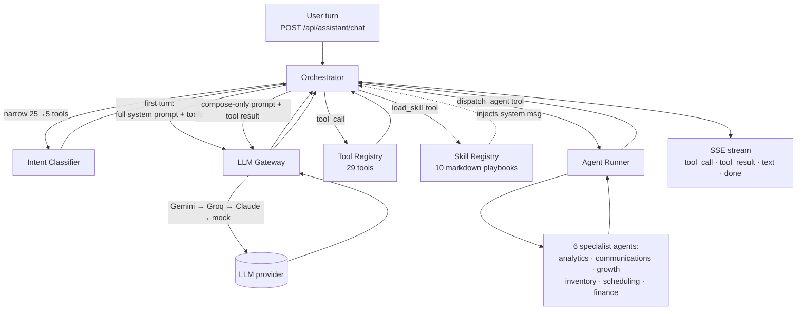

# Smart Garage — AI Assistant Architecture

The in-app assistant is a multi-layer orchestration over commodity LLMs (Gemini → Groq → Claude). A single user turn flows through six well-bounded layers, each replaceable independently.

---

## The six layers



| Layer | Service | Responsibility |
|---|---|---|
| **Orchestrator** | `OrchestratorService` | Owns the turn lifecycle: persists messages, builds system prompts (with **today's date anchor**), runs the classifier, calls the LLM, executes tool calls, gates writes through approvals, and streams SSE events back. |
| **Intent Classifier** | `IntentClassifierService` | Cheap LLM pre-filter that narrows the 29-tool registry to ≤5 candidates. Without it the main-turn prompt would blow Groq's 6 000 TPM ceiling on every query. |
| **LLM Gateway** | `LlmGatewayService` | Provider-agnostic `complete()` API. Tries **Gemini 2.5 Flash-Lite (250k TPM free) → Groq (fast 8b model) → Claude (last resort) → mock**. Translates between OpenAI / Claude / Gemini message and tool-call shapes. |
| **Tool Registry** | `ToolRegistryService` | 29 read/write tools registered at startup, each with a JSON Schema, a blast tier (READ / AUTO_WRITE / CONFIRM_WRITE / TYPED_CONFIRM_WRITE), and an async handler. The orchestrator validates args and surfaces approval prompts before executing CONFIRM_WRITE+ tools. |
| **Skill Registry** | `SkillRegistryService` | 10 markdown playbooks loaded from disk at startup. The LLM dispatches `load_skill` to inject a playbook body as a system message — re-usable, stateless prose that teaches the model how to handle a recurring workflow without bloating every prompt. |
| **Agent Runner** | `AgentRunnerService` | 6 specialist agents, each with its own system prompt, tool whitelist, iteration cap, and required role. Dispatched via the `dispatch_agent` tool. The runner spins a private message log and runs its own tool-call loop until the agent emits a final answer or hits its iteration cap. |

---

## Today's-date anchor

Every system prompt (orchestrator first-turn, orchestrator compose-only, agent-runner) prepends:

> *"Today's date is YYYY-MM-DD (UTC). When the user asks for a time-relative window — 'today', 'last 3 months', 'this quarter' — compute concrete from/to dates relative to TODAY. Never anchor to a year from your training data. If a tool result is 0 or empty, report that exactly — do NOT fabricate figures."*

This kills two failure modes we saw in early testing: stale-year date math (LLM picking 2022 / 2023 instead of the actual year) and zero-result hallucination (LLM inventing plausible numbers when the tool returned nothing).

---

## How to add a new tool

Tools live under `opauto-backend/src/assistant/tools/<domain>/`.

1. Create `<tool-name>.tool.ts` exporting a factory:
   ```ts
   export function createMyTool(deps: { prisma: PrismaService }): ToolDefinition<Args, Result> {
     return {
       name: 'my_tool',
       description: '... include trigger phrases the LLM should map to this tool ...',
       parameters: { type: 'object', additionalProperties: false, required: [...], properties: {...} },
       blastTier: AssistantBlastTier.READ,
       requiredRole: 'OWNER',  // optional
       handler: async (args, ctx) => { /* always scope queries by ctx.garageId */ },
     };
   }
   ```
2. Register in the matching `<domain>-tools.registrar.ts`:
   ```ts
   this.toolRegistry.register(createMyTool({ prisma: this.prisma }));
   ```
3. The orchestrator picks it up automatically on next start.

**Patterns to follow:**
- Always `where: { garageId: ctx.garageId }` — tenant isolation is non-negotiable.
- Use the right `blastTier`: READ for queries, AUTO_WRITE for self-actions (e.g. `send_email` to the user themselves), CONFIRM_WRITE for outbound messages or new bookings, TYPED_CONFIRM_WRITE for money movement.
- The description is the LLM's only signal at routing time — list trigger phrases.

---

## How to add a new skill

Skills live under `opauto-backend/src/assistant/skills/<skill-name>/`.

1. Create `en.md` (the source of truth) with frontmatter + body:
   ```markdown
   ---
   name: my-skill
   description: One-line summary for the LLM router. Include common phrasings.
   triggers: [keyword, phrase, that, hints, at, this, skill]
   tools: [tool_a, tool_b, tool_c]
   ---

   You are <role>. The orchestrator has placed today's date in the system context — anchor relative dates to TODAY.

   ## Data gathering
   ...

   ## Output format
   ...
   ```
2. (Optional) add `fr.md` and `ar.md` with the same frontmatter and translated bodies. Missing locales fall back to `en.md` automatically.
3. The `nest-cli.json` `assets` config copies `*.md` files into `dist/` at build time. **A full backend restart is required** for the `SkillRegistryService` to pick up new skill directories — watch mode does not auto-reload skills.
4. The LLM discovers the skill through the orchestrator's first-turn system prompt (which lists every skill's name + description) and loads it on demand via the `load_skill` tool.

**Patterns to follow:**
- Anchor dates to TODAY explicitly in the body — never bake in years.
- Tell the LLM exactly which tools to call in what order.
- Specify the output format (sections, tables, length cap) — without it, the LLM rambles.
- For action-oriented skills (e.g. `invoice-collections`), draft messages but let the user trigger the actual `send_*` calls so each gets its own approval.

---

## How to add a new agent

Agents live under `opauto-backend/src/assistant/agents/`.

1. Create `<my-agent>.ts`:
   ```ts
   import { AgentDefinition } from '../types';

   const SYSTEM_PROMPT = `You are <Name>, the <domain> specialist for the garage.
   ...prompt body...`;

   export function createMyAgent(): AgentDefinition {
     return {
       name: 'my-agent',
       description: 'When to dispatch this agent (the LLM reads this).',
       systemPrompt: SYSTEM_PROMPT,
       toolWhitelist: ['tool_a', 'tool_b', ...],
       iterationCap: 6,
       requiredRole: 'OWNER',
     };
   }
   ```
2. Register in `agents/agents.registrar.ts`:
   ```ts
   const agents: AgentDefinition[] = [
     ...existing,
     createMyAgent(),
   ];
   ```
3. Update `agents/agents.spec.ts` registration count + name array.

**Patterns to follow:**
- Tight tool whitelist — agents are bounded, not open-ended.
- `iterationCap` 5–10 is right; higher caps invite runaway loops.
- Lean on the agent-runner's date-anchor system message; don't repeat it in your prompt.
- Forbid the LLM from inventing data: *"Never invent SKUs, supplier prices, or part numbers — only report what the tools return."*

---

## Agents — what each one does

| Agent | Purpose (one sentence) |
|---|---|
| `analytics-agent` | Read-only multi-tool deep-dives that produce concrete, numerically grounded answers (e.g. *"compute monthly revenue segmented by service type for the last 6 months"*). |
| `communications-agent` | Drafts customer-facing SMS / email copy in the user's locale, personalised from each customer's profile, leaving the actual sending to the orchestrator's approval gate. |
| `growth-agent` | Long-form business strategist that pulls revenue, customer-mix, churn, invoice, and pipeline data, then proposes recommendations with each line tied to a specific number. |
| `inventory-agent` | Parts and stock specialist for low-stock triage, restock recommendations sized by minimum-quantity rules, and supplier prep. |
| `scheduling-agent` | Calendar / booking specialist for *"what does my week look like"*, *"find a slot"*, reschedule planning, and capacity questions. |
| `finance-agent` | Invoicing, revenue, and collections specialist that translates relative windows like *"last 3 months"* or *"this quarter"* into explicit `from`/`to` dates and chases overdue payment in priority order. |

## Skills — what each one does

| Skill | Purpose (one sentence) |
|---|---|
| `customer-360` | Compiles a one-page deep-dive on a single customer — profile, vehicles, recent activity, invoice status, churn risk, and a concrete next action. |
| `daily-briefing` | Five-section morning snapshot: revenue today vs. 7-day average, new customers, active jobs, overdue invoices, at-risk + low-stock. |
| `email-composition` | Draft and send transactional emails for invoice delivery, payment reminders, service reminders, and ad-hoc owner-to-customer notes. |
| `growth-advisor` | Walks the owner through 3–5 concrete growth ideas grounded in this garage's actual customer mix and revenue trends. |
| `inventory-restocking` | Identifies parts at or below minimum, computes suggested order quantities (`2 × minQty − qty`), and groups by category for separate POs. |
| `invoice-collections` | Pulls overdue invoices, ranks by `daysOverdue × amount`, and drafts one short SMS reminder per top customer for one-click sending. |
| `maintenance-due-followup` | Surfaces cars whose next predicted service falls within 60 days and drafts a personal SMS reminder per top-priority customer. |
| `monthly-financial-report` | Month-by-month P&L-style summary with revenue, paid invoices, outstanding totals, top customers, and a delta vs. the prior month. |
| `retention-suggestions` | Given an at-risk customer, proposes a tailored retention offer (discount tier, message tone, channel) before any outreach is sent. |
| `example` | No-op skill used by the loader's tests; not surfaced to end users. |

---

## Operational notes

- **Daily-rotating quotas:** Gemini Flash-Lite gives 1 000 RPD on the free tier. The orchestrator's classifier + main + compose flow uses ~3 calls per user turn, so ~330 user queries/day before throttling. Bump to a paid tier for production.
- **Watch-mode caveat:** `nest start --watch` reloads `.ts` changes but **not** new skill markdown files. After adding a skill directory, do a hard restart (`pkill nest && npm run start:dev`).
- **Tool registry hot-load:** the orchestrator pulls the user's role/module entitlements at every turn, so adding a tool with `requiredRole: 'OWNER'` will be filtered out for staff without code changes.
- **Approval flow:** any CONFIRM_WRITE+ tool call streams a `approval_required` SSE event with the args; the user clicks approve/deny on the chat panel; the orchestrator then resumes the turn from the same conversation thread.

---

## Approval state machine

```
                  ┌────── 5 min TTL ──────┐
                  ↓                        │
PENDING_APPROVAL ─┴→ APPROVED ───────→ EXECUTED  ← happy path
                 └→ DENIED   ───────→ (terminal, no execution)
                 └→ EXPIRED  ───────→ (terminal, no execution)
```

`AssistantToolCall.status` lives in Postgres. The orchestrator persists the row when it streams `approval_required`, then waits for the frontend to call `POST /api/assistant/approvals/:id/decide` with `{decision: 'APPROVE' | 'DENY', typedConfirmation?: string}`. After a decision, the frontend re-issues `POST /api/assistant/chat` with `userMessage: "__resume__:<toolCallId>"`.

### `__resume__:<toolCallId>` resume sentinel

A reserved user-message format. The orchestrator's `handleResume()` reads the row, materialises a synthetic `assistant: tool_call` + `tool: tool_result` pair into the LLM message log so the model has context, and then either:
- **APPROVED** → emits the `tool_call` + `tool_result` SSE events, executes the tool, returns `'continue'` so the iteration loop composes a final reply (or chains into the next tool).
- **DENIED short-circuit** (UI Bug 3 + B-19 fix, commit `e34b898`) → emits `tool_result {status:'denied', result:{skipped:true, reason:'user_denied'}}`, emits a deterministic `text` ack ("Okay — I won't run `<tool>`. …"), persists the assistant message, emits `done`, completes the SSE subject, and returns `'finished'` so the caller bails before the LLM is reinvoked. **Never re-enters the LLM loop after a denial** — earlier we did, and the model immediately retried the same tool with the same payload (B-19 finding).
- **EXPIRED / FAILED / EXECUTED / not_found** → returns `'not_found'`; the orchestrator emits an `error` SSE event "approval not found or no longer pending" and ends the turn.

### `_expectedConfirmation` (TYPED_CONFIRM_WRITE only)

For tools at the highest blast tier (currently only `record_payment`), the LLM must populate `_expectedConfirmation` in the args with the canonical string the user has to type to approve (e.g. the invoice number for `record_payment`). The frontend collects the typed string and includes it as `typedConfirmation` in the decide POST. The approval service compares them server-side and rejects with 400 if they don't match. The handler is invoked only after the typed match succeeds.

### Adding a new write-tier tool — checklist

1. `blastTier: AssistantBlastTier.CONFIRM_WRITE` (or `TYPED_CONFIRM_WRITE` if money/fiscal — the user must type a confirm token).
2. Validate critical args INSIDE the handler too (defence-in-depth — the JSON-schema layer can be bypassed by direct invocation; see commits `a40fbfd` for `send_sms`, `6fb21c2` for `record_payment`).
3. Re-check `ctx.garageId` ownership against any id args before calling out to a service — never trust ids the LLM produced.
4. For id args, prefer `{type: 'string', format: 'uuid'}` so an LLM hallucination like `"banana"` is rejected before an approval card is shown (I-012).
5. Tools that should NOT be re-tried after deny rely on the `handleResume` short-circuit; no per-tool work needed. Future agent-runner write tools must call into the same DENIED short-circuit semantics.

## In-app help catalogue

Users can click the `?` icon in the assistant panel header to open the **Help modal** — an in-app catalogue of every Tool, Skill, and Specialist Agent the assistant offers, with a one-line description and an example prompt for each. The example prompts are written for non-technical garage owners ("How many customers do I have?" rather than `customer_count(filter:{...})`).

The catalogue is fully i18n'd. **Source of truth for the user-facing names, descriptions, and examples is `assistant.help.*` in `src/assets/i18n/{en,fr,ar}.json`** — when you add a new tool / skill / agent, update those keys and the corresponding constant array (`TOOL_KEYS` / `SKILL_KEYS` / `AGENT_KEYS`) in `src/app/features/assistant/components/assistant-help-modal/assistant-help-modal.component.ts`.
